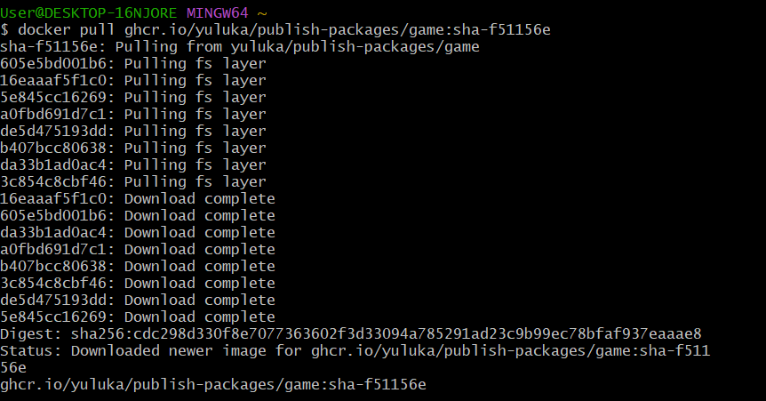
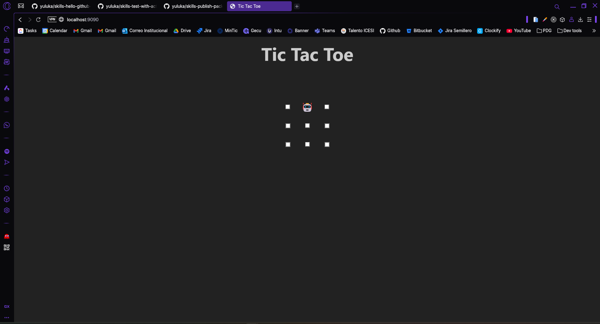

<header>

<!--
  <<< Author notes: Course header >>>
  Include a 1280×640 image, course title in sentence case, and a concise description in emphasis.
  In your repository settings: enable template repository, add your 1280×640 social image, auto delete head branches.
  Add your open source license, GitHub uses the MIT license.
-->

# Publish to GitHub Packages

_Use GitHub Actions to publish your project to a Docker image._

</header>

<!--
  <<< Author notes: Step 4 >>>
  Start this step by acknowledging the previous step.
  Define terms and link to docs.github.com.
-->

## Step 4: Pull your image

_Now things are running! :sparkles:_

Whoa, now things are running! This may take a few minutes. This might take a tiny amount of time, so grab your popcorn :popcorn: and wait for the build to finish before moving on.

:cook: While we wait for the build to finish, let's take care of a few prerequisites.

For ease of use and cross-platform compatibility (Windows, Mac, and Linux), we'll focus on Docker Desktop. Not to be confused, Docker Engine is the foundation for running containers while **[Docker Desktop](https://www.docker.com/blog/how-to-check-docker-version/)** bundles Docker Engine, a GUI, and a Virtual Machine in a _single installation_.

1. Install [Docker Desktop for Windows](https://docs.docker.com/desktop/install/windows-install/#install-docker-desktop-on-windows).
   * If you're using Mac or Linux, locate the correct install steps at the previous link via the lefthand tree menu.
1. Open Docker Desktop and [briefly explore](https://docs.docker.com/desktop/use-desktop/).
1. For running `docker` commands, access the command-line terminal either via Bash, Git Bash, Windows Command Prompt or PowerShell.

:inbox_tray: To pull the Docker image, we need to log into Docker first.

Before we can use this Docker image, you will need to generate a [personal access token (classic)](https://docs.github.com/en/authentication/keeping-your-account-and-data-secure/creating-a-personal-access-token) that contains the following permissions:

**Scopes for Personal Access Token (classic)** :coin:
- repo (all)
- write:packages
- read:packages


We will use this token to log in to Docker, and authenticate with the package.

1. Open your terminal (Bash or Git Bash recommended).
1. Use the following command to log in:
   ```bash
   docker login ghcr.io -u USERNAME
   ```
1. Replace `USERNAME` with your GitHub username.
1. Enter your new Personal Access Token as the password.
1. Press **Enter**.

If everything went well, :crossed_fingers: you should see `Login Succeeded` in your terminal.

### :keyboard: Activity: Pull your image

1. Copy the `pull` command from the package instructions.
   - :fire: _Tip: To reach this page, click the **Code** tab at the top of your repository. Then, find the navigation bar below the repository description, and click the **Packages** heading link_
     
   - Or alternatively, in the following URL replace `YOURNAME`, `REPONAME`, and browse to `https://github.com/users/YOURNAME/packages?repo_name=REPONAME` and click on the package name
1. Replace `YOURNAME` with your GitHub username.
1. Replace `TAG` with the image tag.
1. Paste the `pull` command into your terminal. It should look something like this:
   - `docker pull ghcr.io/YOURNAME/publish-packages/game:TAG`
1. Press **Enter**.
1. You should see output indicating that the pull was successful, like `Status: Downloaded newer image for ghcr.io/YOURNAME/publish-packages/game:TAG`.
   
1. _We can't automatically verify this step for you, so please continue on to the next step below!_
<!--
  <<< Author notes: Step 5 >>>
  Start this step by acknowledging the previous step.
  Define terms and link to docs.github.com.
-->

## Step 5: Run your image

_Nicely done grabbing your Docker image! :relaxed:_

Let's trying running it.

### :keyboard: Activity: Run your image

1. Find your image information by typing `docker image ls`.
   <!-- This screenshot should be changed. -->
1. Use the following command to run a container from your image:
   ```bash
   docker run -dp 8080:80 --rm <YOUR_IMAGE_NAME:TAG>
   ```
1. Replace `YOUR_IMAGE_NAME` with your image name under the `REPOSITORY` column.
1. Replace `TAG` with the image tag under the `TAG` column.
1. Press **Enter**.
1. If everything went well, you will see hash value as output on your screen.
1. Optionally, you can open [localhost:8080](http://localhost:8080) to see the page you just created.
1. _We can't automatically verify this step for you, so please continue on to the next step below!_
<!--
  <<< Author notes: Finish >>>
  Review what we learned, ask for feedback, provide next steps.
-->

## Finish

_Congratulations friend, you've completed this course!_


Here's a recap of all the tasks you've accomplished in your repository:

- You wrote a workflow that sends a code through a continuous delivery pipeline.
- You built a fully deployable artifact.
- You did so using GitHub Actions and GitHub Packages!

### What's next?

- Publish your own packages from your projects.
- We'd love to hear what you thought of this course [in our discussion board](https://github.com/orgs/skills/discussions/categories/publish-packages).
- [Take another GitHub Skills course](https://github.com/skills).
- [Read the GitHub Getting Started docs](https://docs.github.com/en/get-started).
- To find projects to contribute to, check out [GitHub Explore](https://github.com/explore).


---

### Last steps evidence

To demonstrate that the final steps where well done, here are the screenshots of the console, and the final result:


_Login en docker_



_Pull Packages_


_Docker Images_


_Run_



_Result_

---

<footer>

<!--
  <<< Author notes: Footer >>>
  Add a link to get support, GitHub status page, code of conduct, license link.
-->

---

Get help: [Post in our discussion board](https://github.com/orgs/skills/discussions/categories/publish-packages) &bull; [Review the GitHub status page](https://www.githubstatus.com/)

&copy; 2023 GitHub &bull; [Code of Conduct](https://www.contributor-covenant.org/version/2/1/code_of_conduct/code_of_conduct.md) &bull; [MIT License](https://gh.io/mit)

</footer>
